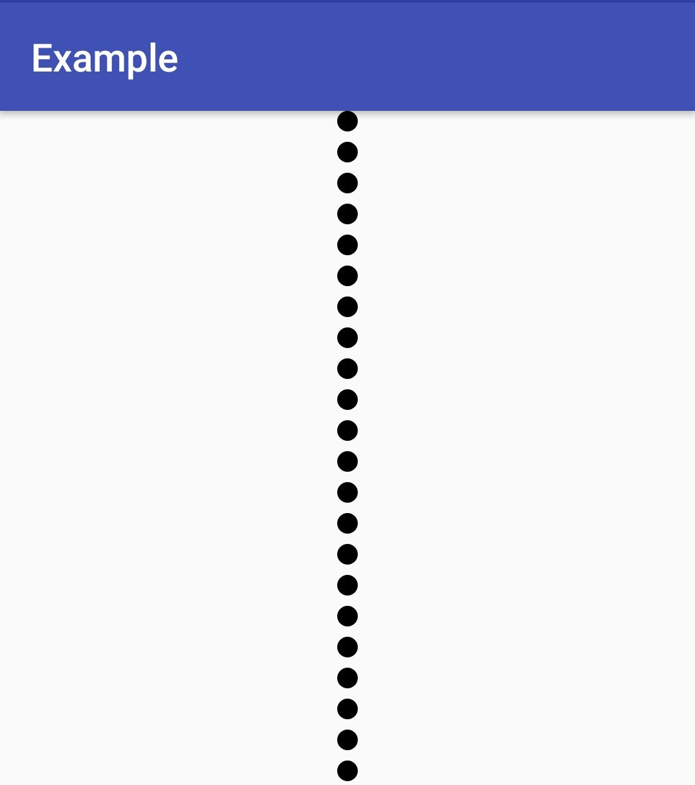

# DottedLineView
[](https://jitpack.io/#Ghedeon/DottedLineView)

As you might have guessed it's a line and it's dotted.




## Import
**Sptep 1.** Add jitpack to your root `build.gradle`:
```gradle
allprojects {
    repositories {
        ...
        maven { url 'https://jitpack.io' }
    }
}
```
**Step 2.** Add the dependency:
```gradle
dependencies {
    implementation 'com.github.ghedeon:dottedLineView:1.0.0'
}
```

## Usage
##### XML:
```xml
<com.ghedeon.dottedlineview.DottedLineView
        android:layout_width="12dp"
        android:layout_height="match_parent"
        app:radius="4dp"
        app:minGap="8dp"
        app:color="@color/colorAccent" />
```
##### Programmatically:
```kotlin
with(dotted_line as DottedLineView) {
            color = Color.BLACK
            radius = 16f
            gap = 16f
        }
```
##### Supported attributes:
|attr|description|
|:---:|:---:|
|`radius`|dot radius|
|`minGap`|gap between dots|
|`color`|dots color|
